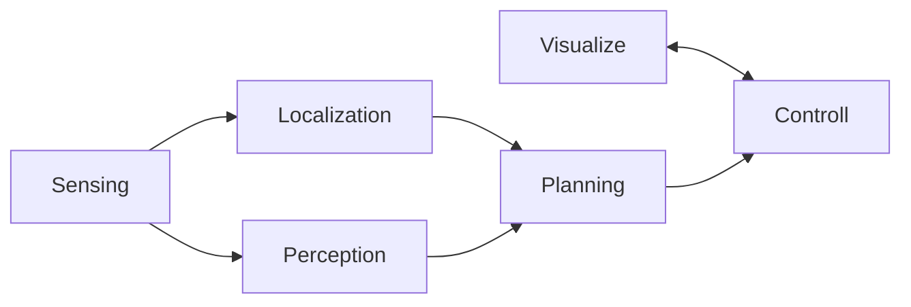
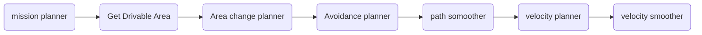
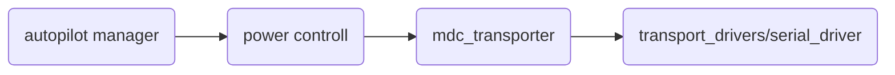
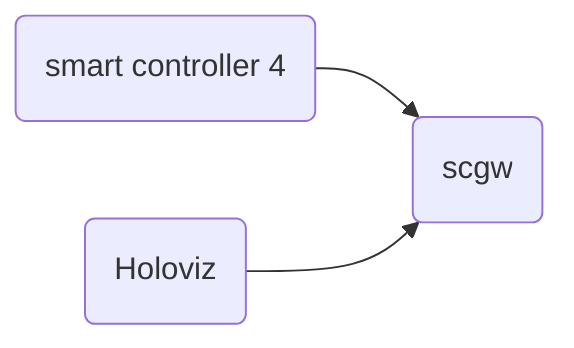
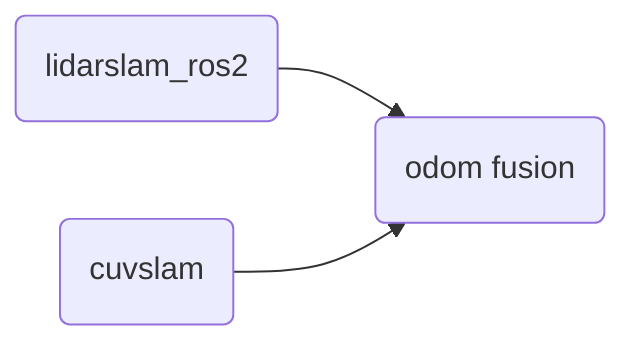
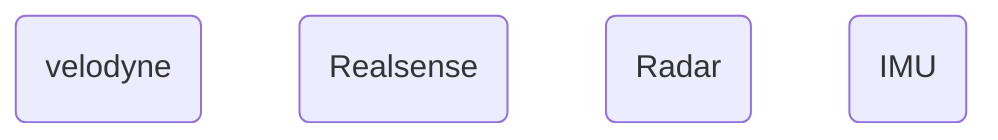
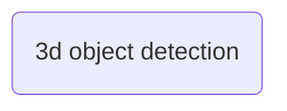

# デザイン

## 全体
自動モードのデザイン。完全手動機の場合はVisualizeとControllだけ。

```mermaid
flowchart LR
    Sensing --> Localization
    Sensing --> Perception
    Localization --> Planning
    Perception --> Planning
    Visualize <--> Controll
    Planning --> Controll
```

## Planning

```mermaid
flowchart LR
    p1(mission planner) --> p2(Get Drivable Area)
    p2 --> p5(Area change planner)
    p5 --> p6(Avoidance planner)
    p6 --> p7(path somoother)
    p7 --> p3(velocity planner)
    p3 --> p4(velocity smoother)
```

## Controll

```mermaid
flowchart LR
    c4(autopilot manager) --> c2(power controll)
    c2 --> c3(mdc_transporter)
    c3 --> c1(transport_drivers/serial_driver)
```

## Visualize

```mermaid
flowchart LR
    s1(smart controller 4) --> s2(scgw)
    s3(Holoviz) --> s2
```

## Localization

```mermaid
flowchart LR
    l2(lidarslam_ros2) --> l1
    l4(cuvslam) --> l1(odom fusion)
```

## Sensing

```mermaid
flowchart TD
   vl(velodyne)
   rs(Realsense)
   radar(Radar)
   imu(IMU)
```

## Perception

```mermaid
flowchart LR
   pe1(3d object detection)
```
