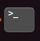
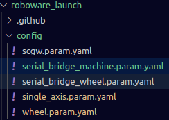

# Launch guide
操縦モードのLaunch（ros2起動）ガイドです。

ターミナルで実行していってください

## Set Parameter
#### visual studio codeでワークスペースを開く
robowareワークスペースに移動します
```bash
cd roboware/src
```
visual studio codeで開きます
```bash
code .
```

写真のようにroboware_launchの中のconfigディレクトリに**.param.yaml**で終わるファイルがあることを確認してください。

これらがパラメーターファイルと呼ばれるものです。



詳しくは[こちら](./parameters.md)をご覧ください

## Build
ワークスペースに移動します
```bash
cd roboware
```
ワークスペースをビルドします
```bash
colcon build --symlink-install --cmake-args -DCMAKE_BUILD_TYPE=Release --cargo-args --release
```
```bash
source install/setup.bash
```

## Debug
#### 足回りのみ用
```bash
ros2 launch roboware_launch wheel_test.launch.xml
```
#### 機構のみ用
```bash
ros2 launch roboware_launch machine_test.launch.xml
```


## Launch
以下のコマンドを用いて起動します。
### Launch a
```bash
ros2 launch roboware_launch manual_a.launch.xml
```

### Launch b
```bash
ros2 launch roboware_launch manual_b.launch.xml
```

## Don't use
以下に示すものはコードの実行に関係のないものです。（触らない）

| launch files | 概要 |
|--|--|
| mecanum_a.launch.xml | a用の足回りをコントロールするためのものです。 |
| mecanum_b.launch.xml | b用の足回りをコントロールするためのものです。 |
| double_serial_bridge.launch.xml | PCからマイコンに転送する部分を起動します。 |
| scgw.launch.xml| スマホアプリとの接続部を起動します。 |